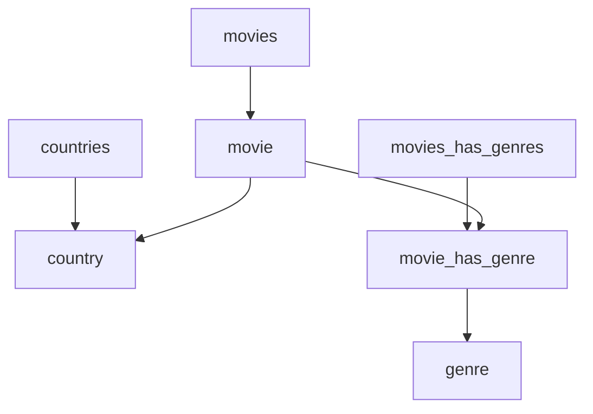

# Movies - xml

## Popis

Struktura souboru xml pro import/export z/do database movies

### movies
- movie
    - id
    - name
    - year
    - country_id

### countries
- country
    - id
    - name

### movies_has_genres
- movie_has_genre
    - movie_id
    - genre_id

### genres
- genre
    - id
    - name

## Rozbor



## EXAMPLE:
```xml
<?xml version="1.0" encoding="UTF-8"?>
<xml>
    <movies>
        <movie>
            <id>1</id>
            <name>Harry Potter a Fénixův řád</name>
            <year>2007</year>
            <country_id>2</country_id>
        </movie>
        <movie>
            <id>2</id>
            <name>Hostitel</name>
            <year>2013</year>
            <country_id>1</country_id>
        </movie>
    </movies>
    <countries>
        <country>
            <id>1</id>
            <name>USA</name>
        </country>
        <country>
            <id>2</id>
            <name>USA</name>
        </country>
    </countries>
    <movies_has_genres>
        <movies_has_genre>
            <movie_id>2</movie_id>
            <genre_id>1</genre_id>
        </movies_has_genre>
        <movies_has_genre>
            <movie_id>2</movie_id>
            <genre_id>2</genre_id>
        </movies_has_genre>
        <movies_has_genre>
            <movie_id>1</movie_id>
            <genre_id>2</genre_id>
        </movies_has_genre>
    </movies_has_genres>
    <genres>
        <genre>
            <id>1</id>
            <name>Thriller</name>
        </genre>
        <genre>
            <id>2</id>
            <name>Fantazy</name>
        </genre>
    </genres>
</xml>
```