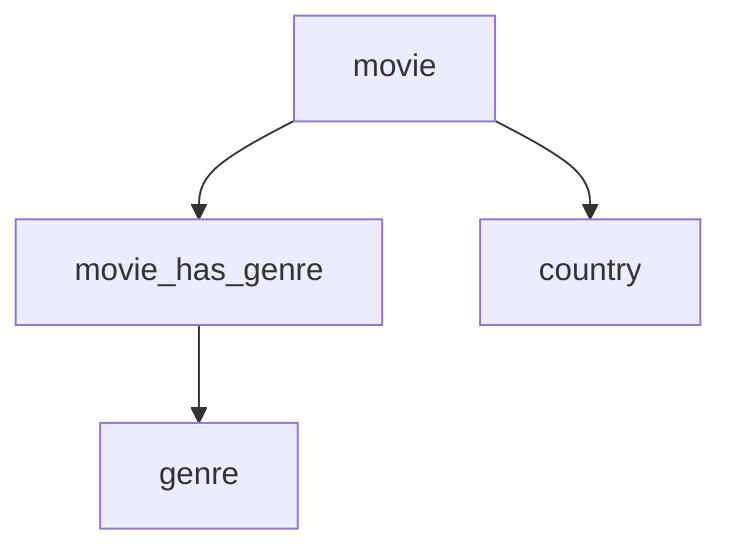

# Movies - yaml

## Popis

### movie
- id
- name
- year
- country_id

### country
- id
- name

### movie_has_genre
- movie_id
- genre_id

### genre
- id
- name

## Rozbor



## EXAMPLE:
```yaml
movie:
  - id: 1
    name: Harry Potter a Fénixův řád
    year: 2007
    country_id: 2
  - id: 2
    name: Hostitel
    year: 2013
    country_id: 1
country:
  - id: 1
    name: USA
  - id: 2
    name: Velká Británie
movie_has_genre:
  - movie_id: 2
    genre_id: 1
  - movie_id: 2
    genre_id: 2
  - movie_id: 1
    genre_id: 2
genre:
  - id: 1
    name: Thriller
  - id: 2
    name: Fantazy
```